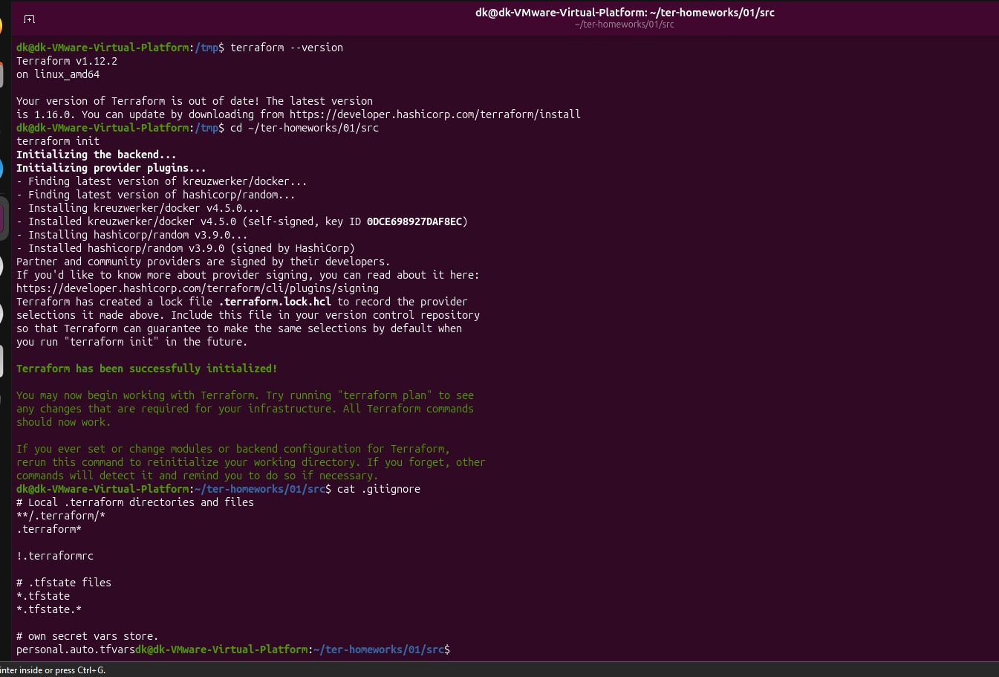
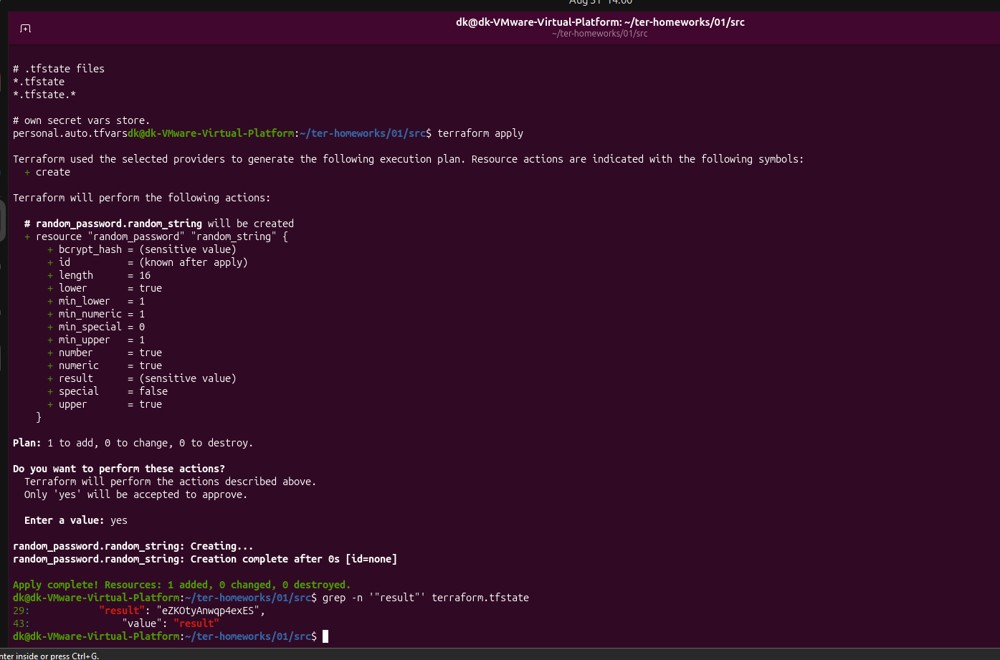
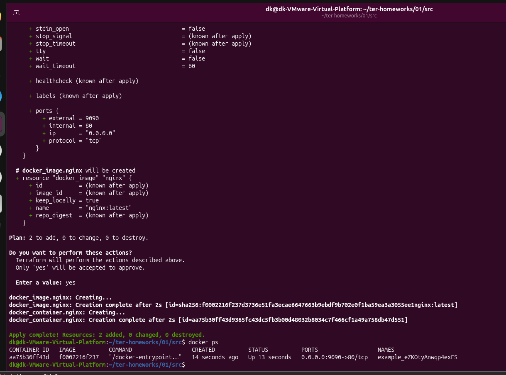
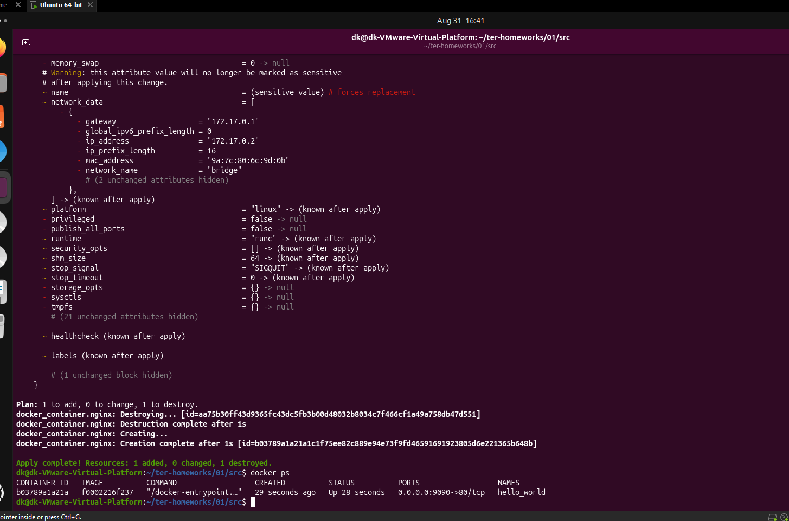
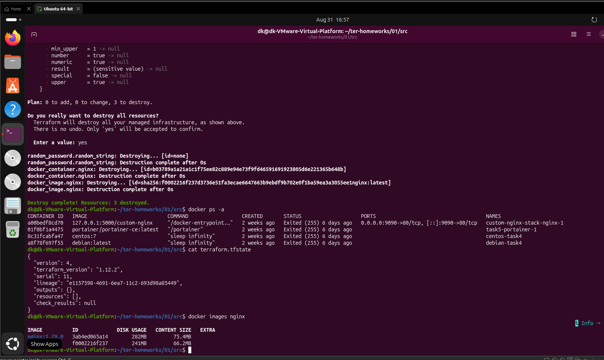

# Домашнее задание «Введение в Terraform»

## Задание 1

### 1. Установка и подготовка

Установлен Terraform версии 1.12.2. Командой `terraform init` загружены необходимые провайдеры.



### 2. Хранение секретной информации

Согласно файлу `.gitignore`, секретную информацию допустимо сохранять в файле:

```text
personal.auto.tfvars
```

Этот файл исключён из Git.

### 3. Содержимое random_password

После выполнения `terraform apply` в файле `terraform.tfstate` найдено значение:

```text
Ключ: result
Значение: eZKOtyAnwqp4exES
```

Файл `terraform.tfstate` в репозиторий не добавлялся.

### 4. Исправление ошибок

Команда `terraform validate` обнаружила следующие ошибки:

1. В блоке `docker_image` отсутствовало локальное имя ресурса.
2. Имя ресурса `1nginx` начиналось с цифры.
3. Ссылка `random_password.random_string_FAKE.resulT` содержала неправильное имя ресурса и регистр атрибута.



Исправленный код:

```hcl
resource "docker_image" "nginx" {
  name         = "nginx:latest"
  keep_locally = true
}

resource "docker_container" "nginx" {
  image = docker_image.nginx.image_id
  name  = "example_${random_password.random_string.result}"

  ports {
    internal = 80
    external = 9090
  }
}
```

После исправления конфигурация успешно прошла проверку `terraform validate`.

### 5. Запуск контейнера

После выполнения `terraform apply` был создан и запущен контейнер Nginx.



### 6. Изменение имени контейнера

Имя контейнера изменено на:

```hcl
name = "hello_world"
```

Изменения применены командой:

```bash
terraform apply -auto-approve
```

Ключ `-auto-approve` автоматически подтверждает применение плана без ввода `yes`. Его опасность заключается в отсутствии ручной проверки: Terraform может сразу изменить или удалить важные ресурсы.

Ключ полезен в CI/CD и других автоматизированных сценариях, где интерактивное подтверждение невозможно.



### 7. Удаление ресурсов

Ресурсы удалены командой:

```bash
terraform destroy
```

После удаления файл `terraform.tfstate` содержит пустой список ресурсов:

```json
{
  "version": 4,
  "terraform_version": "1.12.2",
  "serial": 11,
  "lineage": "e1157598-4691-6ea7-11c2-693d98a85449",
  "outputs": {},
  "resources": [],
  "check_results": null
}
```



### 8. Почему образ Nginx не удалился

В ресурсе `docker_image.nginx` установлен параметр:

```hcl
keep_locally = true
```

Поэтому Terraform удалил контейнер и ресурс из state-файла, но сохранил Docker-образ локально.

В [документации Docker provider](https://registry.terraform.io/providers/kreuzwerker/docker/latest/docs/resources/image.html) указано:

> If true, then the Docker image won't be deleted on destroy operation.
